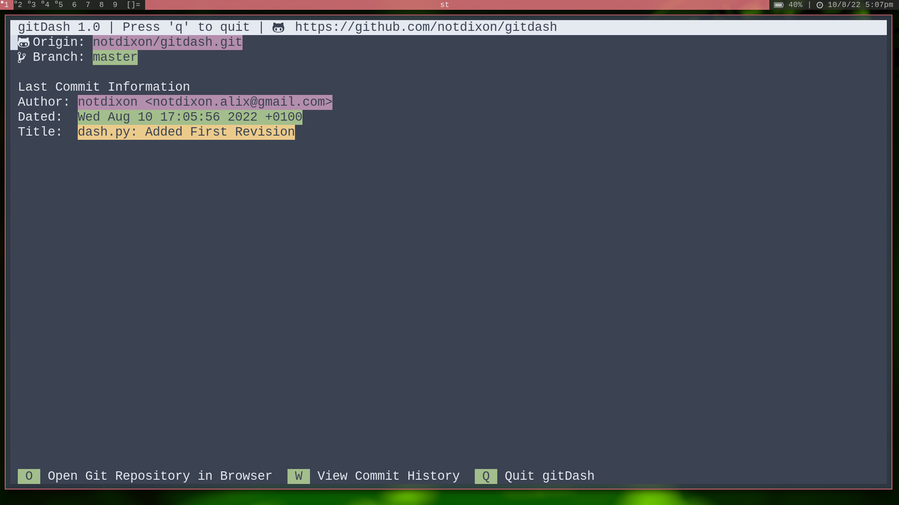

# gitDash
gitDash is a pretty frontend to Git, ie. a curses interface to Git.

Not every feature has been implemented yet, just the very basic features, such as last commit information, the branch
you are on, viewing the commit history and opening the repository in a web browser

## Screenshot
[]

## Planned Features
> *GitHub API Integration* \
>  Allows the user to use their GitHub account, and manage repositories, PRs and other useful stuff like that, however
>  during my testing, Microsoft decided that it was time for me to get rate limited, so my testing ended there.

> *GitLab API Integration* \
>  Same as the GitHub one, but I didn't test it.

# LICENSE
GNU GPL2
